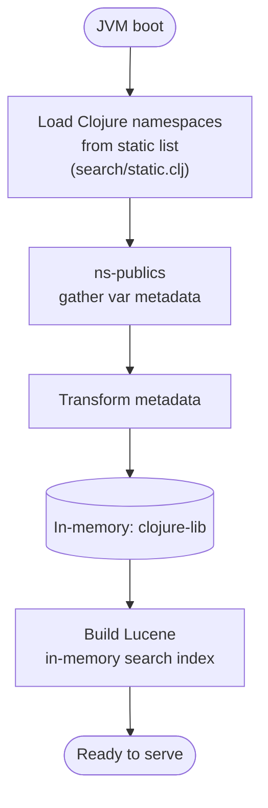
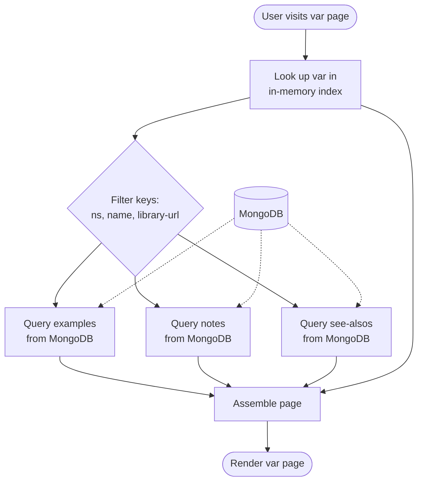
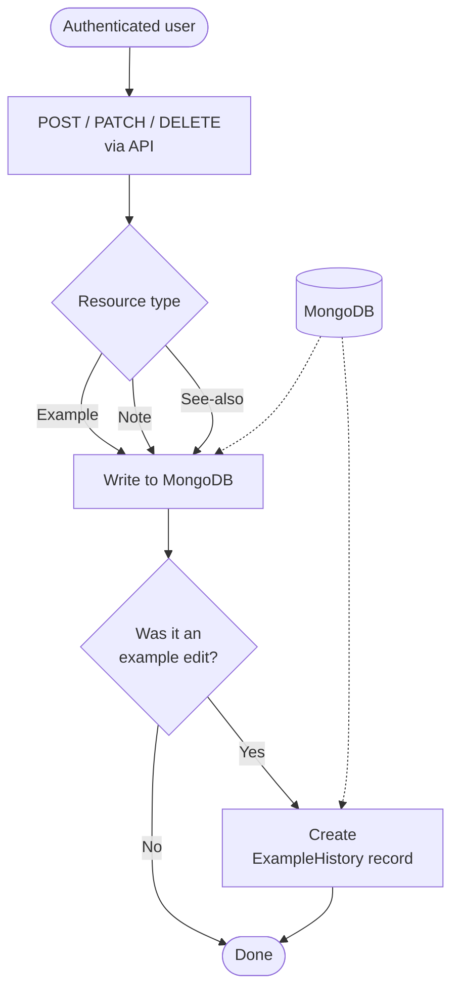
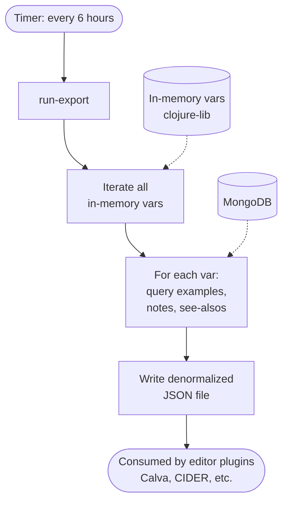

> **Document metadata**
> - **Created:** 2026-06-01
> - **Last updated:** 2026-06-05
> - **Tags:** diagrams, dataflow, architecture
> - **AI-assisted:** Yes — Claude generated Mermaid diagrams from code reading
> - **Review maturity:** AI-drafted; human-reviewed via PR
>
> _AI-assisted document. Flows were traced by reading source code — verify against a running instance for runtime accuracy._

# ClojureDocs Data Flows

## 1. Startup Flow

## 2. Request Flow

## 3. Write Flow

## 4. Export Flow

