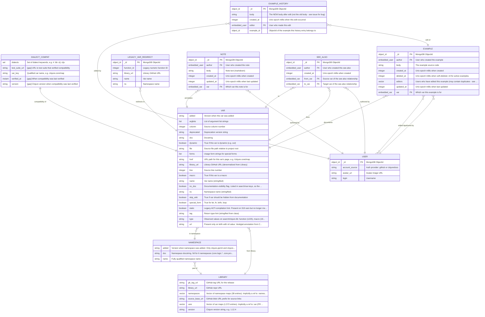

# ClojureDocs Entity-Attribute ER Diagram

*Auto-generated from [`docs/entity-attribute-model.edn`](../entity-attribute-model.edn) by [`tools/edn_to_mermaid.clj`](../../tools/edn_to_mermaid.clj). Do not edit by hand — regenerate with `bb tools/edn_to_mermaid.clj`.*

## Sources

- **Source of truth:** [`docs/entity-attribute-model.edn`](../entity-attribute-model.edn) — the data model (verification scope noted in its header).
- **Narrative model:** [`docs/entity-attribute-model.md`](../entity-attribute-model.md) — entity descriptions and verification.
- **Design rationale:** [`docs/rfcs/entity-model-rfc.md`](../rfcs/entity-model-rfc.md).
- **Issue:** [nubank/clojuredocs#43](https://github.com/nubank/clojuredocs/issues/43).
- **Notation:** [Mermaid entity-relationship diagrams](https://mermaid.js.org/syntax/entityRelationshipDiagram.html).

## Diagram

## Key / Legend

Relationships use Mermaid crow's-foot notation, read left-to-right as `FROM token TO`. The cardinality sits on the side it describes: `}o` = zero-or-more, `||` = exactly-one, `o{` = zero-or-more on the right.

| Cardinality token | Meaning (`from`–`to`) |
|---|---|
| `}o--o{` | many-to-many |
| `}o--||` | many-to-one |
| `||--||` | one-to-one |

| Attribute marker | Meaning |
|---|---|
| `PK` | Primary key (`:_id` — MongoDB ObjectId). |
| `FK` | Reference to another entity. Some are stored as embedded sub-documents that inline fields from the target (`:embedded-var`, `:embedded-user`); others as ObjectId join keys (e.g. `EXAMPLE_HISTORY.example_id`). |
| `[gap]` prefix | Attribute described by the [2026 vision](../2026vison.md) but not yet present in code/data (`:status :gap`). |

Each box lists the entity's present-state attributes (`:status :exists`); the `:_id` row is shown first, the rest alphabetically. JVM-heap and EDN-file entities are test-guarded; MongoDB entities are snapshot-derived and not yet test-guarded ([#66](https://github.com/nubank/clojuredocs/issues/66)). Embedded sub-schemas (`:embedded-var`, `:embedded-user`) are stored inline on the parent document and are not drawn as separate boxes — the `FK` edges point at the canonical [`VAR`](../glossary.md#v)/[`USER`](../entity-attribute-model.md) entities whose fields they embed.

## Provenance & Review

This file is generated; its version is the EDN's `:generated` date (2026-06-09), carried into the frontmatter. Errata are tracked centrally in [`errata.md`](../errata.md). Review notes: [`entity-attribute-er_research-review_run_1.md`](entity-attribute-er_research-review_run_1.md).
