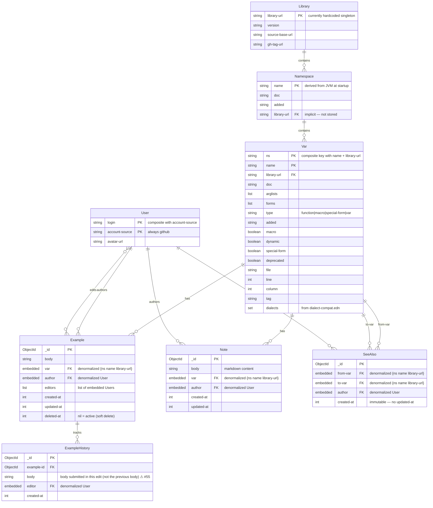
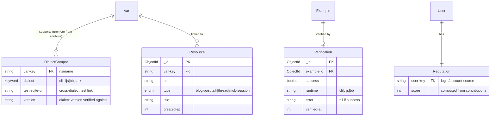

> **Document metadata**
> - **Created:** 2026-06-01
> - **Last updated:** 2026-06-05
> - **Tags:** entity-model, data-model, mongodb, issue-43
> - **AI-assisted:** Yes — Claude Opus 4.6 via GitHub Copilot
> - **Session:** `41bcf361`
> - **Tools:** GitHub MCP, workspace file access
> - **Agents/skills:** [backseat-driver](/.vscode/extensions/betterthantomorrow.calva-backseat-driver-0.0.34/assets/skills/backseat-driver/SKILL.md), [editing-clojure-files](/.vscode/extensions/betterthantomorrow.calva-backseat-driver-0.0.34/assets/skills/editing-clojure-files/SKILL.md)
> - **Review maturity:** L2 — human-reviewed via PR
>
> _AI-assisted document. Entity shapes were extracted by reading source code, not by querying a running system — runtime behavior may differ._

# ClojureDocs Entity-Attribute Model

### Markers

- **⚠** = Known bug or problem in the current codebase. Search this document for `⚠` to find all flagged issues.

| Marker | Issue | Description |
|--------|-------|-------------|
| ⚠ #53 | [nubank/clojuredocs#53](https://github.com/nubank/clojuredocs/issues/53) | `add-indexes-to-coll!` ignores collection argument |
| ⚠ #54 | [nubank/clojuredocs#54](https://github.com/nubank/clojuredocs/issues/54) | `patch-note-handler` missing authorship check |
| ⚠ #55 | [nubank/clojuredocs#55](https://github.com/nubank/clojuredocs/issues/55) | ExampleHistory stores new body, not previous |
| ⚠ #56 | [nubank/clojuredocs#56](https://github.com/nubank/clojuredocs/issues/56) | Typo `:migraion-key` in index definition |

## Current State + Vision Gaps

Solid lines = exists today. Dashed lines = required by vision, not yet implemented.

## Vision Gaps (not yet in codebase)

## Key Observations

| Concern | Current State | Implication |
|---------|--------------|-------------|
| **Var identity** | Composite {ns, name, library-url} — no canonical record, duplicated as embedded sub-docs in every Example, Note, SeeAlso | A var rename requires updating every referencing document |
| **Library** | Hardcoded singleton in `search.clj` | Multi-library support is blocked by the hardcoded singleton; one approach is promoting Library to a persisted entity |
| **Namespace** | Derived from JVM at startup via static list | Adding a namespace requires a code change and deploy |
| **Deletion** | Examples: soft-delete (`deleted-at`). Notes & SeeAlsos: hard-delete (`mon/destroy!`) | Inconsistent audit trail — examples have history, notes and see-alsos vanish without trace |
| **Authorization** | Author-only delete for all three. Example editing: any logged-in user. Note editing: author-only in UI (`can-edit?`) but no authorship check at the API level ⚠ [#54](https://github.com/nubank/clojuredocs/issues/54) | No moderation, no admin, no flagging |
| **Export contract** | `clojuredocs-export.json` consumed by Calva, CIDER | Schema changes risk breaking downstream |
| **Dialect data** | Static EDN file, attribute of Var | Richer dialect metadata (test links, per-dialect versioning) would likely require promoting this to its own entity, though alternatives exist |

## Vestigial Collections

⚠ [#53](https://github.com/nubank/clojuredocs/issues/53) **`add-indexes-to-coll!` bug:** The function in `main.clj` L53-54 ignores its `coll` parameter — every call does `(mon/add-index! :examples [k])` regardless of which collection was passed. This means **no collection other than `:examples` actually gets its intended indexes**, including the actively-used `:see-alsos`, `:notes`, and `:users` collections.

The following collections are called by `add-all-indexes!` but have no active queries in the codebase:

- `:namespaces` — intended index: `[:name]`
- `:libraries` — intended index: `[:namespaces]`
- `:vars` — referenced only in `tools/old_import.clj`
- `:migrate-users` — intended index: `[:email :migraion-key]` (note: typo `migraion` in source ⚠ [#56](https://github.com/nubank/clojuredocs/issues/56))

> Confirm against production MongoDB before dropping.

## Source References

| Entity | Schema defined in | Queried in | Mutated in |
|--------|------------------|------------|------------|
| Example | `api/examples.clj` L43-49 (Insert), L63-65 (Update) | `data.clj` L6-12 | `api/examples.clj` L52-107 |
| ExampleHistory | `api/examples.clj` L68-73 | — | `api/examples.clj` L93 |
| Note | `api/notes.clj` L12-18 | `data.clj` L16-22 | `api/notes.clj` L20-62 |
| SeeAlso | `api/see_alsos.clj` L24-28 | `data.clj` L26-30 | `api/see_alsos.clj` L38-65 |
| User | `api/common.clj` L9-12 | `pages/user.clj` L13 | `pages/gh_auth.clj` L22 |
| Var | `api/common.clj` L14-16 | `search.clj` L148-150 | — (read-only, derived) |
| Library | `search.clj` L112-115 | `pages/vars.clj` L34 | — (hardcoded) |

---

> **AI Disclosure**: This model was extracted from the codebase by Claude (Opus 4.6) via GitHub Copilot and reviewed by Jordan Miller. Entity shapes were read from source code — verify attributes against the source files linked in the Source References table above.
