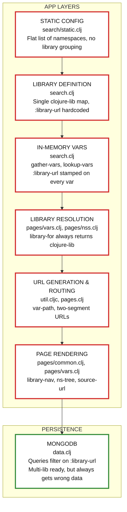

# Multi-Library :library-url Dependency Chain

This diagram shows how the `:library-url` property for each var is handled in the current clojuredocs.org architecture. Each layer is labeled in ALL CAPS, with file references below.

## File References

- **search/static.clj:** https://github.com/nubank/clojuredocs/blob/master/src/clj/clojuredocs/search/static.clj
- **search.clj:** https://github.com/nubank/clojuredocs/blob/master/src/clj/clojuredocs/search.clj
- **pages/vars.clj:** https://github.com/nubank/clojuredocs/blob/master/src/clj/clojuredocs/pages/vars.clj
- **pages/nss.clj:** https://github.com/nubank/clojuredocs/blob/master/src/clj/clojuredocs/pages/nss.clj
- **util.cljc:** https://github.com/nubank/clojuredocs/blob/master/src/cljc/clojuredocs/util.cljc
- **pages.clj:** https://github.com/nubank/clojuredocs/blob/master/src/clj/clojuredocs/pages.clj
- **pages/common.clj:** https://github.com/nubank/clojuredocs/blob/master/src/clj/clojuredocs/pages/common.clj
- **data.clj:** https://github.com/nubank/clojuredocs/blob/master/src/clj/clojuredocs/data.clj

## Context

- **Purpose:** This diagram traces how the `:library-url` property (which should identify the source library for each var) is handled from static config through to database queries.
- **Problem:** All layers except MongoDB treat the system as if there is only one library (Clojure itself). The `:library-url` is hardcoded and stamped on every var, even those from other libraries (e.g., `core.async`, `core.logic`).
- **Impact:** All vars, regardless of their true origin, are labeled as coming from the Clojure repo. MongoDB is capable of supporting multiple libraries, but always receives the wrong `:library-url` due to upstream design.
- **Next Steps:** To support true multi-library documentation, each red layer must be refactored to track and propagate the correct library for each var, and URLs/routes must be extended to disambiguate vars from different libraries.

**For more details, see [Issue #4: Multi-Library Support Audit](https://github.com/nubank/clojuredocs/issues/4).**

